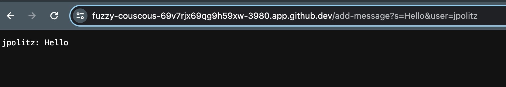
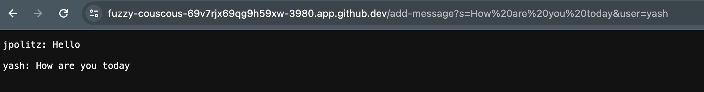

# lab-rep2
lab report - 2
## PART 1:

  CODE:
~~~
import java.io.IOException;
import java.net.URI;
import java.io.BufferedWriter;
import java.io.File;
import java.io.FileWriter;

class ChatHandler implements URLHandler {
  String chatHistory = "";

  public String handleRequest(URI url) {

    // expect /chat?user=<name>&message=<string>
    if (url.getPath().equals("/add-message")) {
      String[] params = url.getQuery().split("&");
      String[] shouldBeUser = params[1].split("=");
      String[] shouldBeMessage = params[0].split("=");
      if (shouldBeUser[0].equals("user") && shouldBeMessage[0].equals("s")) {
        String user = shouldBeUser[1];
        String message = shouldBeMessage[1];
        this.chatHistory += user + ": " + message + "\n\n";
        return this.chatHistory;
      } else {
        return "Invalid parameters: " + String.join("&", params);
      }
    }

    return "404 Not Found";
  }
}

class ChatServer {
  public static void main(String[] args) throws IOException {
    int port = Integer.parseInt(args[0]);
    Server.start(port, new ChatHandler());
  }
}
~~~

Server class used to help complit ChatServer:
~~~
import java.io.IOException;
import java.io.OutputStream;
import java.net.InetSocketAddress;
import java.net.URI;

import java.io.BufferedWriter;
import java.io.FileWriter;
import java.io.PrintWriter;

import com.sun.net.httpserver.HttpExchange;
import com.sun.net.httpserver.HttpHandler;
import com.sun.net.httpserver.HttpServer;

interface URLHandler {
    String handleRequest(URI url);
}

class ServerHttpHandler implements HttpHandler {
    URLHandler handler;
    ServerHttpHandler(URLHandler handler) {
      this.handler = handler;
    }
    public void handle(final HttpExchange exchange) throws IOException {
        // form return body after being handled by program
        try {
            URI uri = exchange.getRequestURI();

            try(FileWriter fw = new FileWriter("session.log", true);
              BufferedWriter bw = new BufferedWriter(fw);
              PrintWriter out = new PrintWriter(bw)) {
              out.println(uri.toString());
            } catch (IOException e) {
              //exception handling left as an exercise for the reader
            }

            String ret = handler.handleRequest(uri);
            // form the return string and write it on the browser
            exchange.sendResponseHeaders(200, ret.getBytes().length);
            OutputStream os = exchange.getResponseBody();
            os.write(ret.getBytes());
            os.close();
        } catch(Exception e) {
            String response = e.toString();
            exchange.sendResponseHeaders(500, response.getBytes().length);
            OutputStream os = exchange.getResponseBody();
            os.write(response.getBytes());
            os.close();
        }
    }
}

public class Server {
    public static void start(int port, URLHandler handler) throws IOException {
        HttpServer server = HttpServer.create(new InetSocketAddress(port), 0);

        //create request entrypoint
        server.createContext("/", new ServerHttpHandler(handler));

        //start the server
        server.start();
        System.out.println("Server Started! Visit http://localhost:" + port + " to visit.");
    }
}
~~~

the main and HandleRequest methods are being used. 
the URL is used as the parameter for HandleRequest method and  3980 is the port number which is the argument for the main method.
inside the HandleRequest method "s" variable stores the message while "user" variable stores the name of the user. another important field being used is the string "chatHistory", which stores starts as an empty string and all the output of all the commands ran get stored in it.

when the first add-message is used, the value of "s" becomes "hello" and user get assigned the value "jpolitz". the output is stored in chatHistory and then returned.

this example also used the same main and HandleRequest methods as the first example.
the same parameters are used but have different input values. "s" stores "how are you today" and "user" stores "yash". the formated output is again stored in chatHistory, but in this case the output of example one also remains in chatHistory. 
so the final return message will be both the examples ran till now one after the other in new lines.

